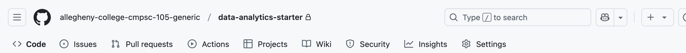

# Data Analytics Lab

Go to the Settings tab in GitHub.

On the left, look for pages. Make your version look like the one that is shown below:

Check your GitHub Actions builds until your website URL is activated!

TODO: Paste your URL into the Discord Thread for urls. I will compile the urls into
the following sheet.

[All urls from your classmates' websites](https://docs.google.com/spreadsheets/d/1bVYuF_9NcIi0qet6Rn7sf6_3gjHtXL4ks6hcPrb1uYU/edit?usp=sharing)
